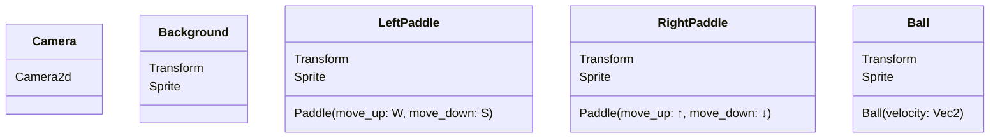
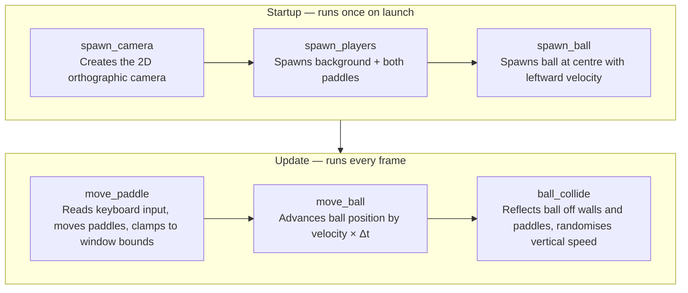

# Architecture

## Bevy ECS Primer

Bevy is built around the Entity-Component-System (ECS) pattern:

- **Entity** — a unique integer ID with no data or behaviour of its own
- **Component** — a plain data struct attached to an entity (e.g. `Paddle`, `Ball`, `Transform`)
- **System** — a plain Rust function that queries entities by their components and acts on the results
- **Resource** — global singleton data available to any system (e.g. `ButtonInput<KeyCode>`, `Time`)

This separation means data and logic are kept completely apart. `move_paddle` doesn't know which specific entity it's operating on — it just asks Bevy for "all entities that have a `Transform` and a `Paddle`" and iterates them.

## Entities and Their Components

There are five entities in the game. Each column is a component type; a tick means the entity has that component.

| Entity | `Transform` | `Sprite` | `Paddle` | `Ball` | `Camera2d` |
|--------|:-----------:|:--------:|:--------:|:------:|:----------:|
| Camera | | | | | ✓ |
| Background | ✓ (default) | ✓ | | | |
| Left paddle | ✓ | ✓ | ✓ | | |
| Right paddle | ✓ | ✓ | ✓ | | |
| Ball | ✓ | ✓ | | ✓ | |



`Transform` holds position (and rotation/scale, though neither is used here). `Sprite` holds colour and size. `Paddle` stores only the two key codes for that player. `Ball` stores only the current velocity vector.

## System Execution Order

Systems are registered in `main()` and run at either `Startup` (once on launch) or `Update` (once per frame).



## Queries

A Bevy query is a typed filter that gives a system read or write access to every entity that matches a set of component types. Bevy resolves the matching entities automatically; the system just iterates the results.

```rust
// Gives mutable access to Transform and read-only access to Paddle
// for every entity that has both components — i.e. both paddles.
Query<(&mut Transform, &Paddle)>

// Gives read-only access to Transform, but only for entities that
// also have a Paddle — avoids accidentally matching the ball or background.
Query<&Transform, With<Paddle>>
```

## Resources

| Resource | Purpose |
|---|---|
| `ButtonInput<KeyCode>` | Tracks which keys are currently pressed |
| `Time` | Provides `delta_secs()` — seconds elapsed since the last frame |
| `Commands` | Queued API for spawning and despawning entities |

`Time::delta_secs()` is multiplied into every movement calculation so that speed is expressed in pixels per second regardless of frame rate. A game running at 30 fps and one running at 120 fps will produce identical motion.
