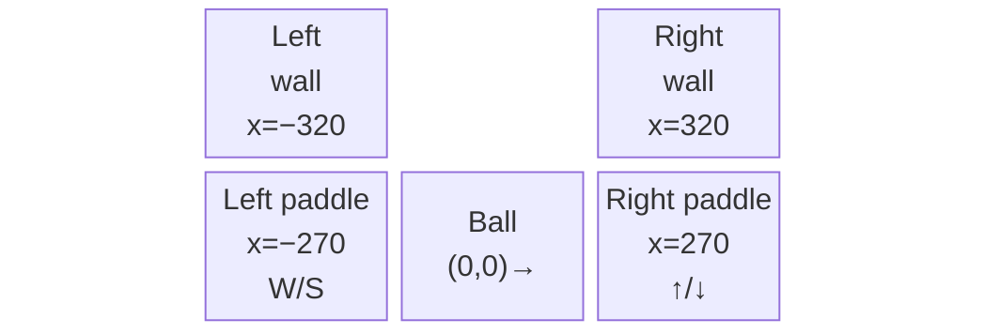
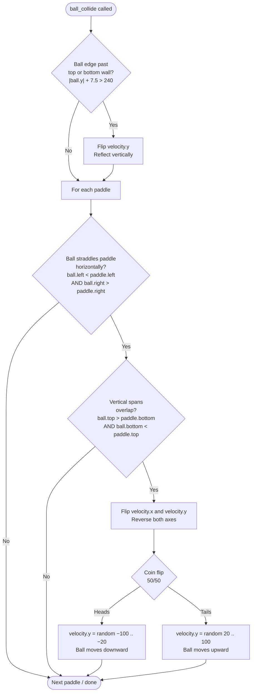
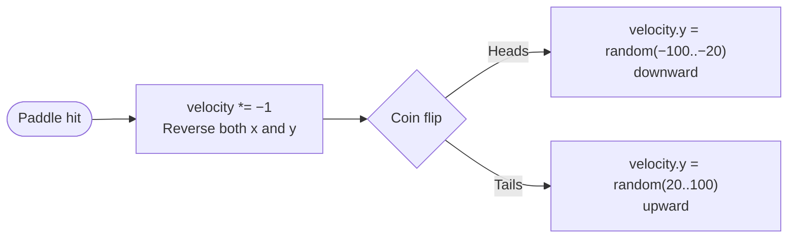

# Gameplay and Physics

## Coordinate System

Bevy's 2D renderer uses a centre-origin coordinate system. The origin `(0, 0)` is the exact middle of the window. Positive x goes right; positive y goes **up** (unlike many 2D frameworks where y increases downward).

```
          +y (up)
           │
 (−320,240)│            (320,240)
    ┌──────┼──────────────────┐
    │      │                  │
 −x │      (0,0)              │ +x (right)
    │      │                  │
    └──────┼──────────────────┘
 (−320,−240)         (320,−240)
           │
          −y (down)
```

The window is 640 × 480 pixels, so the playfield spans x ∈ [−320, 320] and y ∈ [−240, 240].

## Entity Positions

| Entity | x | y (start) | z | Notes |
|--------|---|-----------|---|-------|
| Background | 0 | 0 | 0 | Fills the full window |
| Left paddle | −270 | 0 | 1 | −(640/2) + 50 |
| Right paddle | 270 | 0 | 1 | (640/2) − 50 |
| Ball | 0 | 0 | 2 | Centre of screen |

The z value controls draw order. Higher z renders on top: background (0) → paddles (1) → ball (2).



## Ball Physics

The ball has no mass or gravity. It moves at a constant velocity that changes only on collision.

- **Velocity** is stored in the `Ball(Vec2)` component as `(x_speed, y_speed)` in pixels per second.
- **Position update** each frame: `position += velocity * delta_secs`
- **Initial velocity**: `(−100, 0)` px/s — straight left toward the left paddle.

Because `delta_secs` is the actual elapsed time between frames, the ball travels the same distance per second at any frame rate.

## Collision Detection

`ball_collide` runs every frame and handles two cases: wall bounces and paddle hits.



### Wall bounce

```
|ball.y| + BALL_DIMENSION/2  >  WINDOW_HEIGHT/2
|ball.y| + 7.5               >  240
```

When the ball's top or bottom edge touches the window boundary, `velocity.y` is negated. The ball continues at the same horizontal speed and the same vertical magnitude, just in the opposite vertical direction.

### Paddle collision — AABB straddling check

Standard AABB (axis-aligned bounding box) overlap tests whether two rectangles intersect. Here the horizontal check is slightly different because the ball (15 px wide) is wider than the paddle (10 px wide).

The horizontal condition checks that the ball *straddles* the paddle — the ball's left edge is to the left of the paddle's left edge **and** the ball's right edge is to the right of the paddle's right edge:

```
ball.x − 7.5  <  paddle.x − 5     (ball left  < paddle left)
ball.x + 7.5  >  paddle.x + 5     (ball right > paddle right)
```

This means the paddle's full width fits inside the ball's horizontal span. In practice it triggers when the ball is passing through the paddle's x column.

The vertical condition is a standard overlap test:

```
ball.y + 7.5  >  paddle.y − 35    (ball top    > paddle bottom)
ball.y − 7.5  <  paddle.y + 35    (ball bottom < paddle top)
```

Both conditions must be true simultaneously for a hit to register.

## Ball Deflection After a Paddle Hit

On a paddle hit, both velocity components are negated (reversing direction), then the vertical speed is re-randomised to make rallies unpredictable.



The magnitude is always at least 20 px/s so the ball never travels in a purely horizontal line — a flat trajectory would make positioning trivial for both players. The cap of 100 px/s keeps it at roughly the same speed range as the horizontal component.

## Paddle Movement and Clamping

Paddles move at a fixed 100 px/s. The clamping keeps the paddle sprite fully inside the window:

```
y_min  =  −WINDOW_HEIGHT/2 + PADDLE_OFFSET  =  −240 + 30  =  −210
y_max  =   WINDOW_HEIGHT/2 − PADDLE_OFFSET  =   240 − 30  =   210
```

`PADDLE_OFFSET` is 30 rather than the exact half-height (35) so the paddle stops a few pixels before the wall rather than perfectly flush against it.
